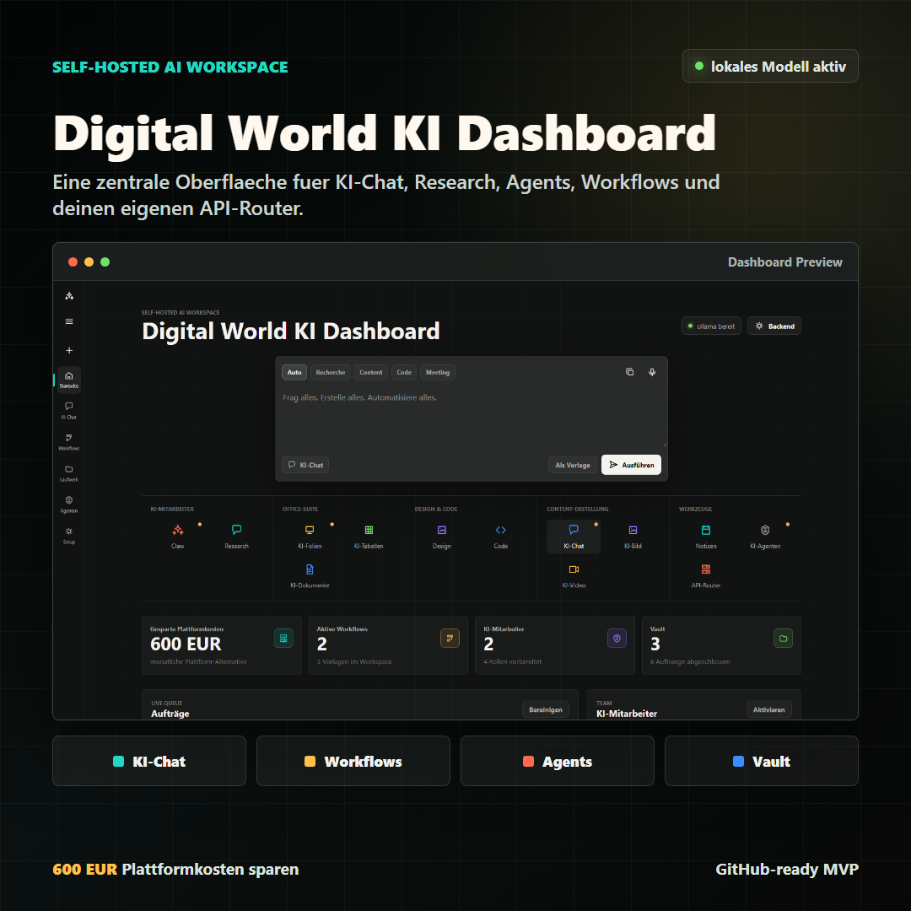

# DW KI App

[](LICENSE)
[](https://github.com/Steve72HH/dw-ki-app/releases)
[](https://github.com/Steve72HH/dw-ki-app)

Self-hosted KI-Dashboard fuer Chat, Workflows und interne KI-Teams.



## About

`DW KI App` ist die rekonstruierte Startversion des frueheren `DW KI Dashboard`.
Die App ist bewusst als schlanke, lokale Workspace-Oberflaeche aufgebaut:
schnell, selbst gehostet und ohne Build-Schritt direkt startbar.

## Features

- Persistenter Chat mit lokaler Speicherung im Browser
- Workflow-Steuerung mit Run, Pause und Statusanzeige
- Prompt-Vorlagen zum schnellen Wiederverwenden
- Import und Export des App-Zustands als JSON
- Reset-Funktion fuer einen frischen Demo-Zustand
- Responsive Dark-UI ohne Build-Tooling

## Run locally

```bash
npm start
```

Danach im Browser oeffnen:

```text
http://127.0.0.1:4173/
```

## Project structure

| File | Purpose |
| --- | --- |
| `index.html` | Dashboard-Oberflaeche |
| `style.css` | Layout, Farben und responsive Darstellung |
| `main.js` | Interaktion, State und Speicherung |
| `serve.js` | Lokaler Static Server ohne Build-Tooling |
| `assets/dashboard-preview.png` | Screenshot fuer die Projektvorschau |

## Roadmap

- Reale KI-Anbindung statt rein lokaler Demo-Logik
- Mehr Platz fuer Inhalte im Dashboard-Layout
- Erweiterbare Prompt- und Workflow-Bibliothek
- Besseres Export- und Backup-Konzept fuer Sessions
- Sauberer Deploy-Pfad fuer Self-hosting und Demo-Betrieb

## Status

- Aktueller Stand ist auf GitHub gespeichert
- Default-Branch ist `main`
- Tag `v0.1.0` markiert den ersten oeffentlichen Snapshot

## Notes

- Die App speichert den Zustand lokal im Browser ueber `localStorage`.
- Mit `Reset Demo` kannst du den gespeicherten Zustand zuruecksetzen.
- Import und Export helfen dir, den Arbeitsstand zwischen Sessions mitzunehmen.

## License

Siehe [LICENSE](LICENSE).
